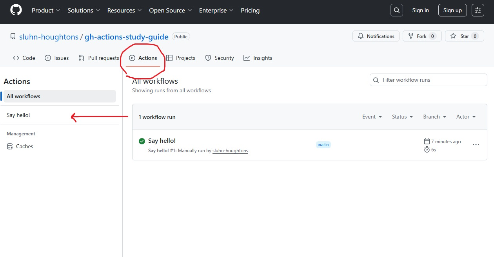
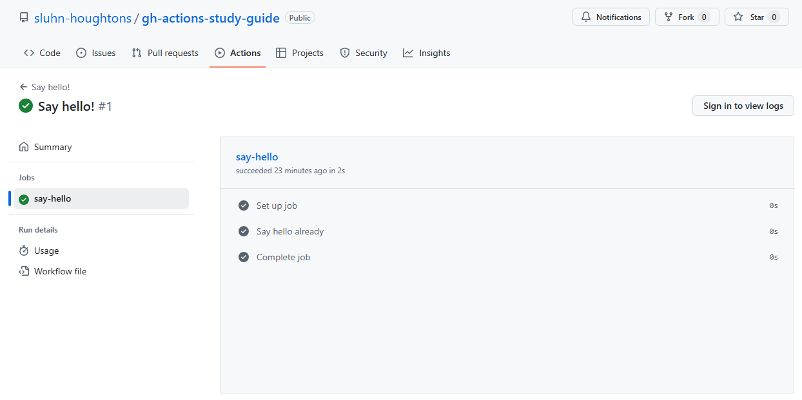

# Github actions study guide

## What is a GitHub action?
A github action is essentially a packaged script that is used to automate tasks. 

I think of them as instructions for a temporary computer to accomplish defined tasks. These instructions are written in a yaml(yet another markup language) which are comprised of 3 main parts. Here's a basic action:

```yml
# 1. describing the action
name: Hello world action
description: for people who need a brighter day

# 2. how it gets triggered
on:
  workflow_dispatch:
    inputs:
      name:
        description: who you are saying hi to
        required: true
        default: world

# 3. what it does
jobs:
  say_hello:
    runs-on: ubuntu-latest
    steps:
      - name: Print a greeting
        run: echo "Hello world!"
```

1. A `name` and `description` to help you or others understand what your action is for.
2. How that action will get triggered with the `on` keyword (i.e. an event or manually activated)
3. What your action does which is defined under the `jobs` keyword.
  - As the name implies, there can be multiple jobs. A job must have a `runs-on` parameter that describes what machine your action will be running on. In this case it's a machine runs on the latest ubuntu operating system.

## exercise:
Write this basic yaml. Do your best to remember the structure(and turn off autocomplete for copilot if you are using it-- you can't have it take the cert for you)

You can look back to reference but try your best to recall what the actions 3 main parts are and what inputs it will take.

In this case it's supposed to be an action that greets people. It's manually run and takes a name input.

Create your workflow in the .github/workflows folder. This is how you get your actions to appear in github. When you add the file you will see that its name matches the name you defined. If you don't define this, it will just be the filename of the workflow.

**Just add and commit your work to the main branch.**



When you go to the action it will have a banner that says this:


You can click on the action when it's done to see what it did.


If you get stuck you can check the solutions folder.