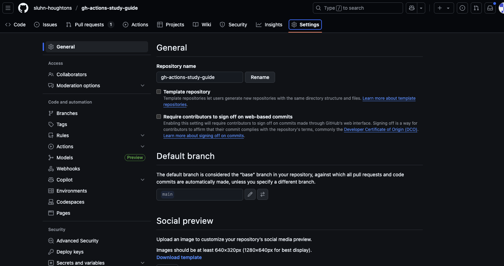

# Branch rules
Ok so you created a PR and assuming that everything worked, you had an action triggered. You can merge this PR but let's pretend that it has errors in it because of failing tests. We can't let that get into main. No way!

So let's create some branch protection rules.

Go to the repo settings:

Click on branches:

and "Add branch ruleset"

- give it a name, call it `pr-approvals` so you stay consistent with the guide. But I can't control what you do.
- Make its enforcement status "Active"
- make the target your default branch
- select "Require a pull request before merging"
  - make it so you need 1 approval before merging
- save your changes.

Now if you go back to your PR, it can't be merged without an approval.
- You obviously can't go on without being able to merge your PRs so go adjust the settings to allow yourself to merge it without a review-- This is just FYI

But now you cannot push directly to main, which you never really should. You'll have to make PRs from here on out.

But it would honestly make more sense if this action did something other than output a string.
Let's make it run some tests in the next step.
